Gruvbox is a retro groove color scheme for Emacs. It is a port of the Vim
version originally by [Pavel Pertsev](https://github.com/morhetz) found
[here](https://github.com/morhetz/gruvbox).

[](http://elpa.nongnu.org/nongnu/gruvbox-theme.html) 

[](https://stable.melpa.org/#/gruvbox-theme) [](https://melpa.org/#/gruvbox-theme)

## Theme versions

#### Gruvbox Dark Medium (aka. Gruvbox _default_)

Theme name `gruvbox-dark-medium`

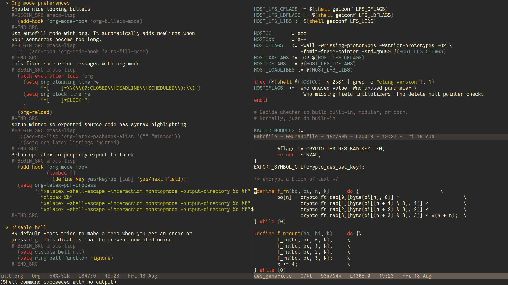

#### Gruvbox Dark Soft

Theme name `gruvbox-dark-soft`

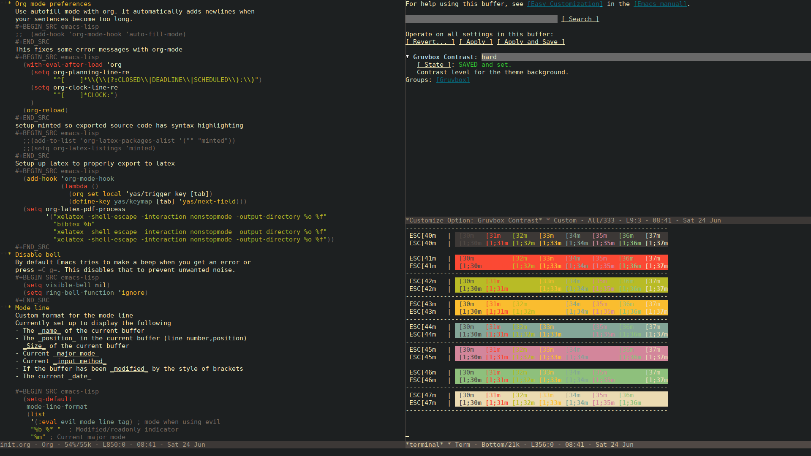

#### Gruvbox Dark Hard

Theme name `gruvbox-dark-hard`

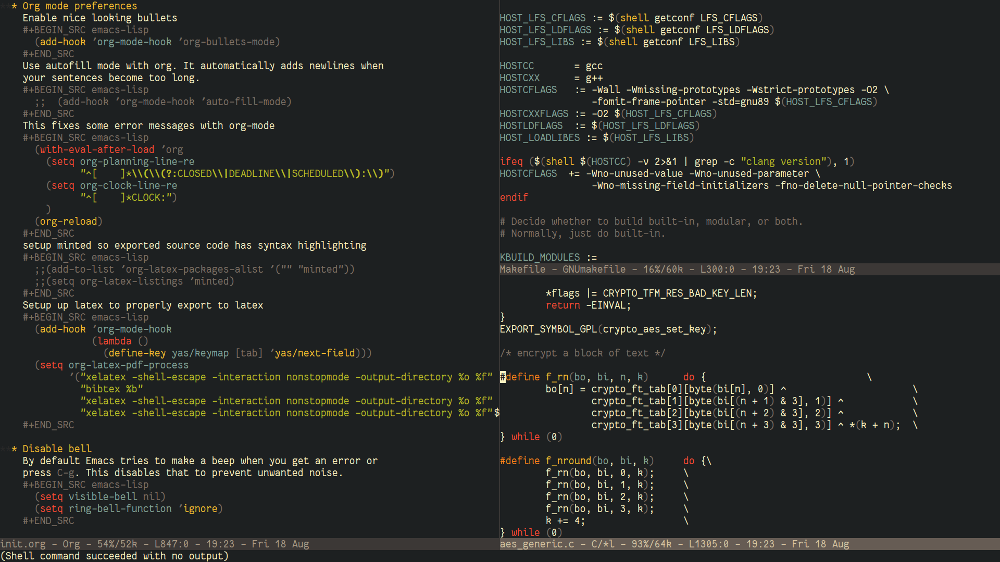

#### Gruvbox Light Medium

Theme name `gruvbox-light-medium`

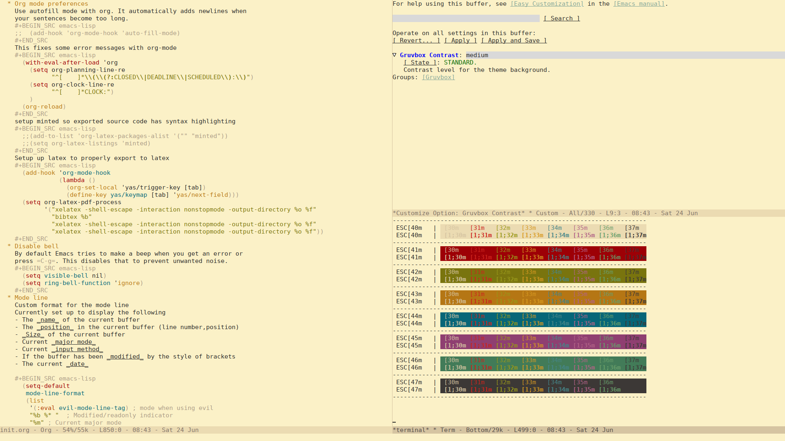

#### Gruvbox Light Soft

Theme name `gruvbox-light-soft`

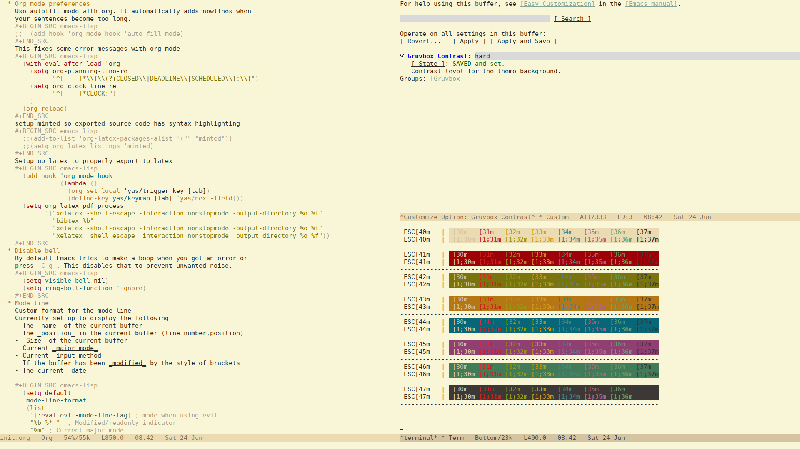

#### Gruvbox Light Hard

Theme name `gruvbox-light-hard`


## Palette

Note the dark and light tones are transposed in the light versions.

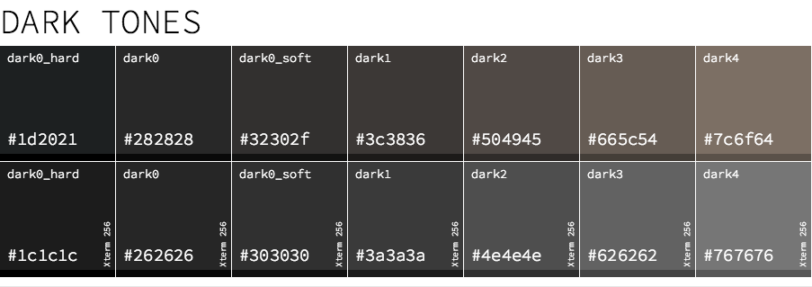

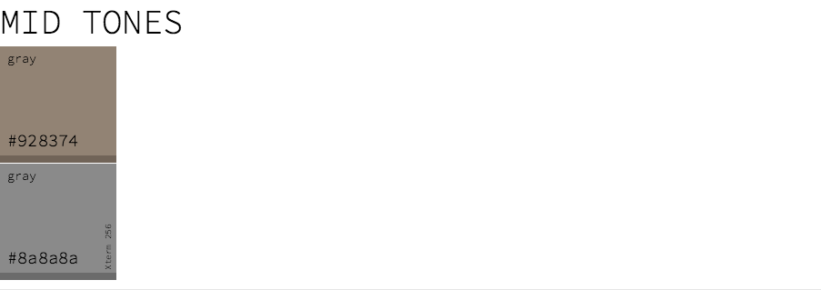

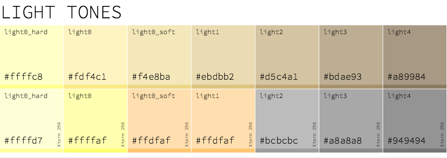

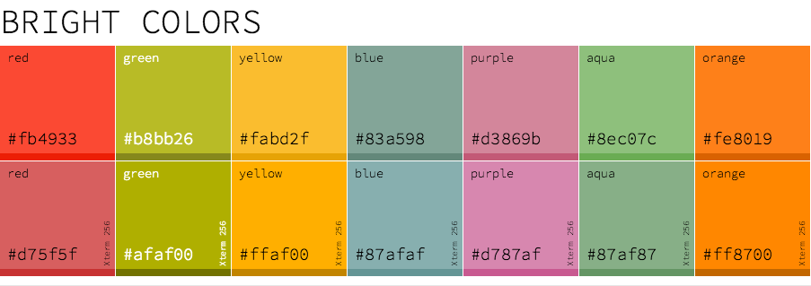


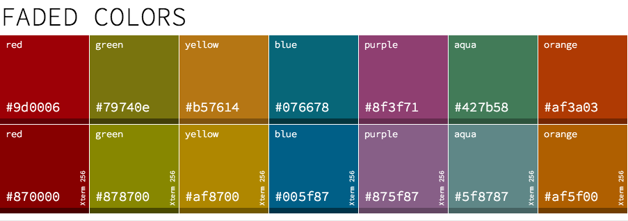

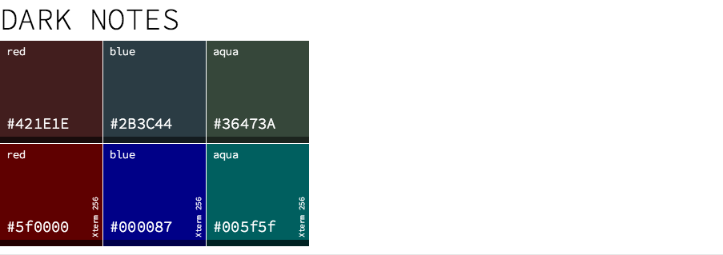

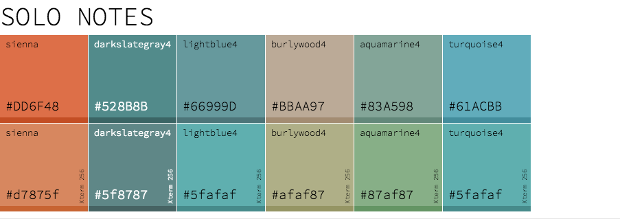

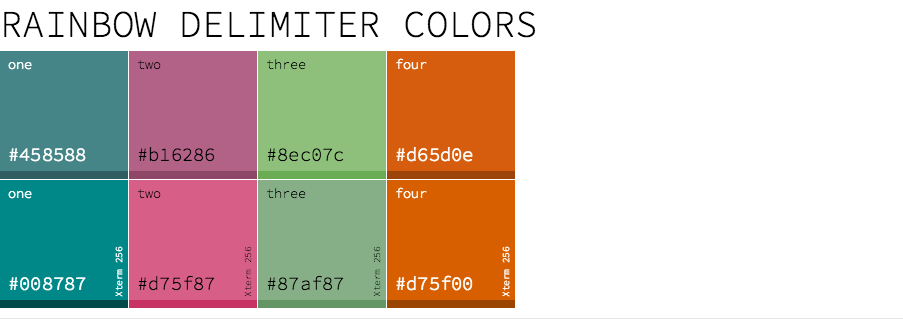

## Mode Support

This theme contains custom support for the following features and plugins:

- [Ag.el](https://github.com/Wilfred/ag.el)
- Ace jump
- Ace window
- [Anzu](https://github.com/syohex/emacs-anzu#customization)
- [Auto-dim-other-buffers](https://github.com/mina86/auto-dim-other-buffers.el)
- [Circe](https://github.com/jorgenschaefer/circe)
- Comint (and the like)
- Company
- [diff-hl](https://github.com/dgutov/diff-hl)
- Diffs
- Dired+
- [Diredfl](https://github.com/purcell/diredfl)
- Elfeed
- [ElScreen](https://github.com/knu/elscreen)
- [ERC](https://www.emacswiki.org/emacs/ERC)
- Eshell
- [Flycheck](https://www.flycheck.org/en/latest/)
- [Gnus](http://gnus.org)
- Helm
- Highlight Indent
- Hydra
- Ivy
- [Js2-mode](https://github.com/mooz/js2-mode)
- LaTeX
- [Linum-relative](https://github.com/emacsmirror/linum-relative)
- Magit
- Markdown
- Message
- [Neotree](https://github.com/jaypei/emacs-neotree)
- Org
- Popup
- [Proof General](https://proofgeneral.github.io/)
- [RainbowDelimiters](http://www.emacswiki.org/emacs/RainbowDelimiters)
- Shell script
- Smart modeline
- [Smartparens](https://github.com/Fuco1/smartparens)
- Term
- Tool Tips
- Undo Tree
- Whitespace-mode
- Widget Faces

## Installation and usage

The recommended way to install the Gruvbox theme is with NonGNU ELPA or MELPA.
The version of `gruvbox-theme` there will always be up-to-date.

### NonGNU ELPA

You can install Gruvbox from [NonGNU
ELPA](http://elpa.nongnu.org/nongnu/gruvbox-theme.html).  This archive is
enabled by default in Emacs 28 or later, so just type `M-x package-install <RET> gruvbox-theme`.

### MELPA

If you're an Emacs 25 user or you have a recent version of `package.el` you can
install the Gruvbox theme from the [MELPA
repository](https://melpa.org/#/gruvbox-theme).

### Manual installation.

Manual installation, clone the repository and add it to your Emacs `load-path` and `custom-theme-path`. 

### Enable themes.

Emacs requires themes to be flagged as safe, use `M-x load-theme` to load and enable the gruvbox themes. 

## Issues

See https://github.com/greduan/emacs-theme-gruvbox/issues

If you want the theme to support something please open a new issue and we'll
try our best to make it happen. :smile: (Roll up your sleeves and submit a pull-request for molto muy karma!)

## License

```
The MIT License (MIT)

Copyright (c) 2013 Lee Machin
              2013-2016 Eduardo Lavaque
              2015-2017 Jason Milkins
              2017-2018 Martijn Terpstra

Permission is hereby granted, free of charge, to any person obtaining a copy of
this software and associated documentation files (the "Software"), to deal in
the Software without restriction, including without limitation the rights to
use, copy, modify, merge, publish, distribute, sublicense, and/or sell copies of
the Software, and to permit persons to whom the Software is furnished to do so,
subject to the following conditions:

The above copyright notice and this permission notice shall be included in all
copies or substantial portions of the Software.

THE SOFTWARE IS PROVIDED "AS IS", WITHOUT WARRANTY OF ANY KIND, EXPRESS OR
IMPLIED, INCLUDING BUT NOT LIMITED TO THE WARRANTIES OF MERCHANTABILITY, FITNESS
FOR A PARTICULAR PURPOSE AND NONINFRINGEMENT. IN NO EVENT SHALL THE AUTHORS OR
COPYRIGHT HOLDERS BE LIABLE FOR ANY CLAIM, DAMAGES OR OTHER LIABILITY, WHETHER
IN AN ACTION OF CONTRACT, TORT OR OTHERWISE, ARISING FROM, OUT OF OR IN
CONNECTION WITH THE SOFTWARE OR THE USE OR OTHER DEALINGS IN THE SOFTWARE.
```
