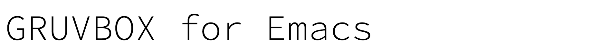
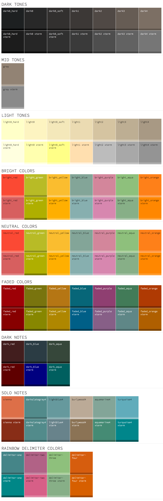

Gruvbox is a retro groove color scheme for Emacs. It is a port of the Vim
version originally by [Pavel Pertsev](https://github.com/morhetz) found
[here](https://github.com/morhetz/gruvbox).

Pavel's version has evolved since this version was made, and now
includes a light version, and other changes.  Syntax highlighting is
applied differently in the Vim version too.

We are in the process of adding a light version and we'll also try to add
a version which maps syntax closer to the current Vim Gruvbox.

We won't be changing the main Emacs Gruvbox theme, because there's a
lot of people who've been using it for a few years, and we don't want
to mess with their preferences.



## Supports

This theme contains custom support for the following features and plugins:

- Ace jump
- Ace window
- [Anzu](https://github.com/syohex/emacs-anzu#customization) support
- Comint (and the like)
- Company
- Diffs
- Dired+
- [ElScreen](https://github.com/knu/elscreen)
- Elfeed
- Helm
- Highlight Indent
- Ivy
- Markdown
- Message
- Org
- Popup
- [RainbowDelimiters](http://www.emacswiki.org/emacs/RainbowDelimiters)
- Smart modeline
- [Smartparens](https://github.com/Fuco1/smartparens)
- Term
- [Ag.el](https://github.com/Wilfred/ag.el)
- [Js2-mode](https://github.com/mooz/js2-mode)
- [Linum-relative](https://github.com/emacsmirror/linum-relative)
- Whitespace-mode

## Installation and usage

The recommended way to install the Gruvbox theme is with MELPA.

### MELPA

If you're an Emacs 24 user or you have a recent version of `package.el` you can
install the Gruvbox theme from the [MELPA
repository](http://melpa.milkbox.net/#/gruvbox-theme). The version of
`gruvbox-theme` there will always be up-to-date.

### No `package.el`

The following instructions are for in the case where you don't have access to
`package.el` for some reason.

1. Download `gruvbox-theme.el`, and put it in `~/.emacs.d/themes`. For example:
   ```shell
   curl https://raw.github.com/Greduan/emacs-theme-gruvbox/master/gruvbox-theme.el > ~/.emacs.d/themes/gruvbox-theme.el
   ```

1. Tell Emacs where to find themes in your `init.el` or `.emacs` file:
   ```lisp
   (add-to-list 'custom-theme-load-path "~/.emacs.d/themes")
   ```

1. Enable the theme:
   ```
   M-x load-theme RET gruvbox
   ```
   Or add the following to your `init.el` or `.emacs` file to load the theme at startup:
   ```
   (load-theme 'gruvbox t)
   ```


## Issues

See https://github.com/greduan/emacs-theme-gruvbox/issues

If you want the theme to support something please open a new issue and we'll
try our best to make it happen. :smile:

## License

```
The MIT License (MIT)

Copyright (c) 2013 Lee Machin
              2013-2016 Greduan
              2015-2017 Jason Milkins

Permission is hereby granted, free of charge, to any person obtaining a copy of
this software and associated documentation files (the "Software"), to deal in
the Software without restriction, including without limitation the rights to
use, copy, modify, merge, publish, distribute, sublicense, and/or sell copies of
the Software, and to permit persons to whom the Software is furnished to do so,
subject to the following conditions:

The above copyright notice and this permission notice shall be included in all
copies or substantial portions of the Software.

THE SOFTWARE IS PROVIDED "AS IS", WITHOUT WARRANTY OF ANY KIND, EXPRESS OR
IMPLIED, INCLUDING BUT NOT LIMITED TO THE WARRANTIES OF MERCHANTABILITY, FITNESS
FOR A PARTICULAR PURPOSE AND NONINFRINGEMENT. IN NO EVENT SHALL THE AUTHORS OR
COPYRIGHT HOLDERS BE LIABLE FOR ANY CLAIM, DAMAGES OR OTHER LIABILITY, WHETHER
IN AN ACTION OF CONTRACT, TORT OR OTHERWISE, ARISING FROM, OUT OF OR IN
CONNECTION WITH THE SOFTWARE OR THE USE OR OTHER DEALINGS IN THE SOFTWARE.
```
